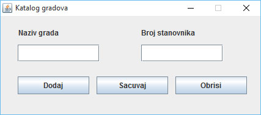

# Zadatak 1

**NAPOMENA: PO ZAVRŠETKU ZADATKA OBAVEZNO TESTIRATI REŠENJE POZIVANJEM AUTOMATIZOVANIH TESTOVA (desnim tasterom na naziv projekta, Run as - Java Application - PokreniTestove)**

Napraviti javnu klasu **GradException** u paketu **grad.exception** koja predstavlja neproveravani izuzetak i ima:
- Javni konstruktor koji kao parametar prima poruku greške i poziva odgovarajući konstruktor nadklase prosleđujući mu parametar.

Napraviti javnu klasu **Grad** u paketu **grad** koja može da bude serijalizovana i ima:
- Privatni atribut **naziv**. Početna vrednost za ovaj atribut je "nepoznat".
- Privatni atribut **brojStanovnika**. Početna vrednost za ovaj atribut je nula.
- Odgovarajuće **javne get i set metode** za ove atribute. Nedozvoljene vrednostu za atribut naziv su null i svi Stringovi koji imaju manje od dva slova, a broj stanovnika mora biti veći od nule. Uslučaju unosa nedozvoljenih vrednosti, baciti izuzetak klase GradException sa odgoarajućom. porukom.
- Redefinisanu **equals** metodu klase Object. Metoda prvo proverava da li je uneti objekat klase Grad, pa ako nije baca izuzetak klase GradException. Metoda vraća true ako je naziv grada jednak nazivu unetog grada, a inače vraća false.

Napraviti javni interfejs **Demografija** u paketu **grad** koji ima:
- Metodu **dodajGrad** koja ne vraća ništa i prima kao parametar objekat klase **Grad**.
- Metodu **upisiGradoveUKategorije** koja ne vraća ništa i nema ulazne parametre. Metoda baca proveravani izuzetak klase Exception.

Napraviti javnu klasu **KatalogGradova** u paketu **grad** koja implementira interfejs **Demografija** i ima:
- Privatni atribut **gradovi** koji predstavlja listu objekata klase Grad. Ovu listu je potrebno odmah inicijalizovati.
- Implementiranu javnu metodu **dodajGrad** koja kao parametar prima objekat klase **Grad** i unosi ga u listu. Unošenje se vrši samo ako u listi već ne postoji isti grad i to tako da se sačuva opadajući poredak liste prema broju stanovnika. Ako u listi već postoji isti grad, ili ako je nastao neki izuzetak, potrebno je baciti izuzetak tipa **GradException** sa odgovarajućom porukom.
- Implementiranu javnu metodu **upisiGradoveUKategorije** koja podatke o gradovima iz liste se upisuje (serijalizuje) u tri fajla: "mali\_gradovi.out", "srednji\_gradovi.out" i "veliki\_gradovi.out" i to u zavisnosti od broja stanovnika (veličine). Gradovi sa manje od sto hiljada stanovnika su mali, srednji gradovi imaju između sto hiljada i milion stanovnika, a veliki gradovi preko milion stanovika. Ako je nastao neki izuzetak, potrebno je baciti izuzetak tipa **GradException** sa odgovarajućom porukom.

Napraviti vizuelnu klasu **GradoviGUI** u paketu **grad.gui** koja izgleda kao na slici. Naslov prozora bi trebalo da bude "Katalog gradova". Podesiti grafički interfejs tako da se u toku rada aplikacije ne mogu menjati dimenzije forme.
- Klasa KatalogGradovaGUI bi trebalo da sadrži privatni atribut **katalog** koji predstavlja objekat klase KatalogGradova. Odmah inicijalizovati objekat.
- Kada se pritisne dugme "Obrisi", briše se sadržaj svih elemenata na formi.
- Kada se pritisne dugme "Dodaj", preuzimaju se svi podaci o gradu iz polja za unos i u katalog se dodaje novi grad pozivom metode **dodajGrad**. Ukoliko se dogodi greška prilikom dodavanja grada u katalog, ispisati u JOptionPane dijalogu poruku "Greška prilikom dodavanja grada". U slučaju da je unos uspešan, ispisati u JOptionPane dijalogu poruku "Grad je uspešno dodat".
- Kada se pritisne dugme "Sačuvaj", svi gradovi u katalogu se upisuju u odgovarajuće kategorije u katalogu pozivom metode **upisiGradoveUKategorije**. Ukoliko je čuvanje uspešno obavljeno, ispisati u JOptionPane dijalogu poruku "Gradovi su sačuvani". U suprotnom, ispisati poruku "Greška prilikom čuvanja gradova".

# Zadatak 2 (ispravka koda)

** NAPOMENA: PO ZAVRŠETKU ZADATKA OBAVEZNO TESTIRATI REŠENJE POZIVANJEM AUTOMATIZOVANIH TESTOVA (desnim tasterom na naziv projekta, Run as - Java Application - PokreniTestove)**

U produžetku teksta je dat kod klase sa metodom koja kao parametar dobija listu String vrednosti i iz te liste izbacuje duplikate tj. Stringove koji se pojavljuju dva ili više puta i to tako da na kraju ostane samo jedno pojavljivanje datog String-a. Metoda na kraju ispisuje sadržaj liste (bez duplikata) na ekranu. Na primer, ako metoda kao ulaz dobije listu sa pet String vrednosti :"Pera", "Mika", "Zika", "Pera", "Pera", konačan izlaz na ekranu treba da izgleda ovako:

	[Pera, Mika, Zika]

Dati kod se kompajlira, ali ne radi to šta treba. Napraviti klasu **StringOperacije** u paketu **ispravka_koda**, prekucati u nju kod koji je dat i, uz minimalne izmene ga ispraviti tako da funkcioniše kako treba. Napraviti test klasu i, koristeći njenu **main** metodu, pozvati metodu **izbaciDuplikate()** i proveriti njen rad.

	import java.util.List;
	
	public class StringOperacije {
		public static void izbaciDuplikate(List<String> lista) {
			boolean imaDuplikata;
			do {
				imaDuplikata = false;
				for (int i = 0; i < lista.size(); i++)
					if (lista.lastIndexOf(lista.get(i)) != -1) {
						lista.remove(lista.lastIndexOf(lista.get(i)));
						imaDuplikata = true;
						return;
					}
			} while (!imaDuplikata);
			System.out.println(lista);
		}
	}